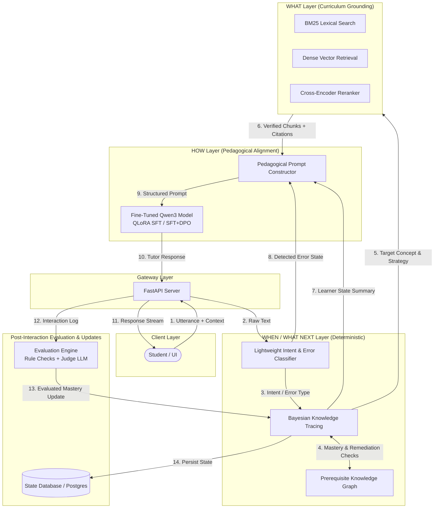

# System Architecture: Pedagogically Aligned Personalized AI Education Tutor

This document details the software and systems architecture of the pedagogical tutor, illustrating the runtime inference flow, offline training pipeline, and the rigid separation of responsibilities among system components.

---

## 1. Architectural Principles & Separation of Concerns



---

## 2. Component Responsibilities

### 2.1 The "WHAT" Layer: Curriculum Grounding (RAG)
- **Goal**: Supply authoritative, license-clean curriculum knowledge without relying on parametric model recall.
- **Components**:
  - **Lexical Retriever (`BM25`)**: Captures exact mathematical formulations, definitions, and named theorems.
  - **Semantic Retriever (`Dense Embeddings`)**: Embeds semantic queries using dense sentence transformers.
  - **Result Fusion & Reranker (`Cross-Encoder`)**: Reranks top-$k$ fused candidates, ensuring only highly relevant chunks reach the prompt.
  - **Metadata Preservation**: Retains textbook name, grade, chapter, concept identifier, and license info.

### 2.2 The "HOW" Layer: Pedagogical Alignment (Fine-Tuned Qwen3)
- **Goal**: Generate responses that embody Socratic questioning, scaffolding, misconception remediation, and answer restraint.
- **Base Models**:
  - **Small Scale**: `Qwen/Qwen3-4B-Instruct`
  - **Large Scale**: `Qwen/Qwen3.8-27B`
- **Training Stages**:
  - **Stage 1 (QLoRA SFT)**: Aligns the base model to pedagogical dialogue formats, hint generation, and scaffolding.
  - **Stage 2 (QLoRA DPO)**: Suppresses premature solution reveals, answer dumping, and ungrounded statements using pedagogical preference pairs.

### 2.3 The "WHEN / WHAT NEXT" Layer: Learner State & Progression
- **Goal**: Objectively track concept mastery and determine when to advance or remediate.
- **Strict Invariant**: The language model never updates learner mastery state directly.
- **Components**:
  - **Lightweight Intent / Error Classifier**: Classifies student input into states: `correct_understanding`, `partial_understanding`, `misconception`, `missing_prerequisite`, `confused`, `request_hint`, `request_direct_answer`.
  - **Bayesian Knowledge Tracing (BKT)**:
    - Prior mastery: $P(L_0)$
    - Transition probability: $P(T)$
    - Guess probability: $P(G)$
    - Slip probability: $P(S)$
    - Posterior update upon observation $o_t \in \{0, 1\}$:
      $$P(L_t | o_t = 1) = \frac{P(L_{t-1}) (1 - P(S))}{P(L_{t-1}) (1 - P(S)) + (1 - P(L_{t-1})) P(G)}$$
      $$P(L_t | o_t = 0) = \frac{P(L_{t-1}) P(S)}{P(L_{t-1}) P(S) + (1 - P(L_{t-1})) (1 - P(G))}$$
      $$P(L_{t+1}) = P(L_t | o_t) + (1 - P(L_t | o_t)) P(T)$$
  - **Prerequisite Knowledge Graph**: Directed Acyclic Graph (DAG) mapping concepts to prerequisites. If mastery of a prerequisite $P(L_{\text{prereq}}) < \tau_{\text{mastery}}$ (default $\tau = 0.85$), the system mandates prerequisite review before advancing.

---

## 3. Structured Prompt Construction

To avoid prompt injection, confusion, or syllabus hallucination, the prompt is structured into isolated sections:

```
======================================================================
[SYSTEM / PEDAGOGICAL INSTRUCTIONS]
You are a Socratic STEM tutor. Guide the student toward discovering
the answer rather than giving it away directly.
STRATEGY: <SCAFFOLD | HINT | SOCRATIC_QUESTION | DIAGNOSE | ANSWER_REVEAL>

[LEARNER MASTERY STATE]
Target Concept: <concept_name>
Current Estimated Mastery: <p_mastery>
Prerequisite Gaps: <none | list_of_unmastered_prereqs>
Consecutive Failures: <count>

[RETRIEVED CURRICULUM CONTEXT]
Source: NCERT Class 10 Math, Chapter 3
Excerpt: "..."

[STUDENT CONVERSATION HISTORY]
Student: ...
Tutor: ...
Student: ...
======================================================================
```

---

## 4. Training & MLOps Pipeline

1. **Curriculum Pipeline**: Ingest PDF/text -> Clean -> Chunk (512 tokens, 64 overlap) -> Vector Index + BM25 Index.
2. **SFT Data Pipeline**: 100 hand-authored gold examples -> Synthetic generation -> Automated rule filtering -> Human validation -> JSONL dataset.
3. **DPO Data Pipeline**: SFT model rollouts -> Scored by pedagogical rubric -> Form chosen/rejected pairs.
4. **Fine-Tuning Engine**: QLoRA (4-bit NF4 quantization, LoRA $r=16, \alpha=32$, target modules `q_proj, k_proj, v_proj, o_proj, gate_proj, up_proj, down_proj`) with TRL `SFTTrainer` and `DPOTrainer`.
5. **Experiment Tracking**: MLflow logs configuration, loss trajectories, evaluation scores, git SHA, and adapter artifacts.
6. **Serving**: Checkpoint merge / adapter serving via vLLM behind FastAPI.
